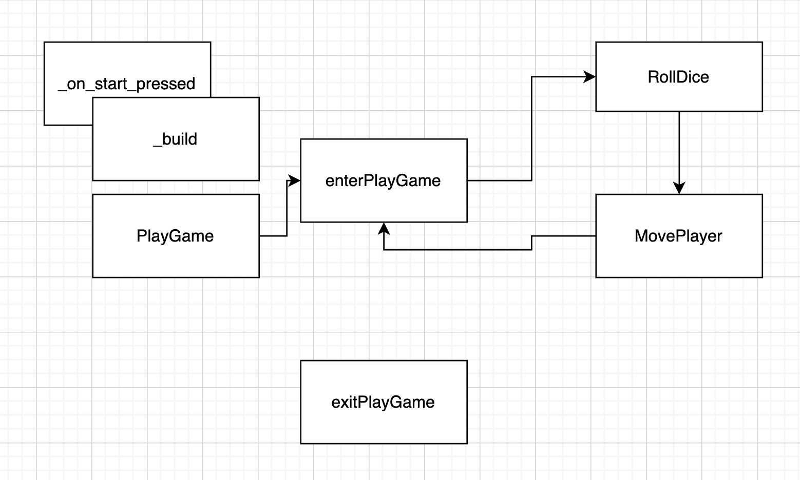

# monopoly 2d implementation to learn panda3d

## build

```
python -m pygbag --archive --template noctx.tmpl --ume_block 0 main.py
```

## FSM configuration

The FSM loops over those states. A global variable `self.actor` is used to apply different behaviour while traversing the states.




## publish

Manually uploaded to [itch.io](https://pacman81.itch.io/monopoly-2d-prototype)

